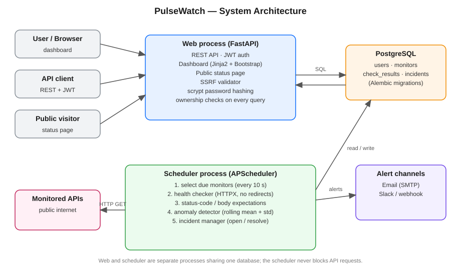
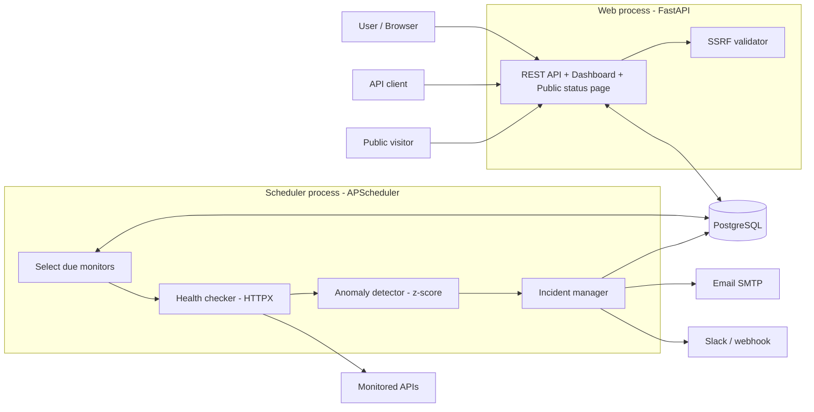
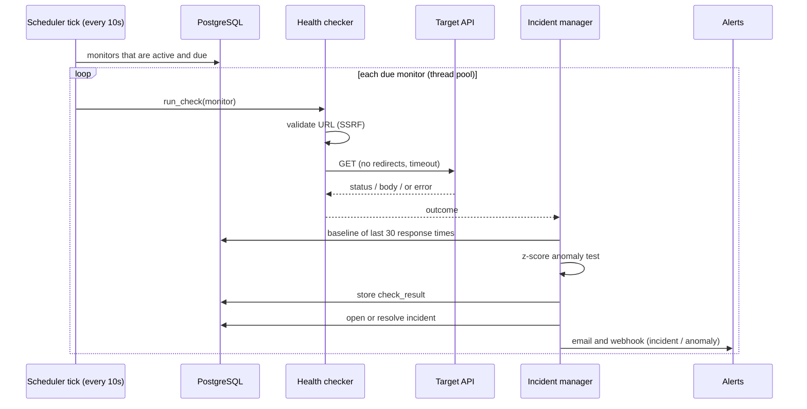
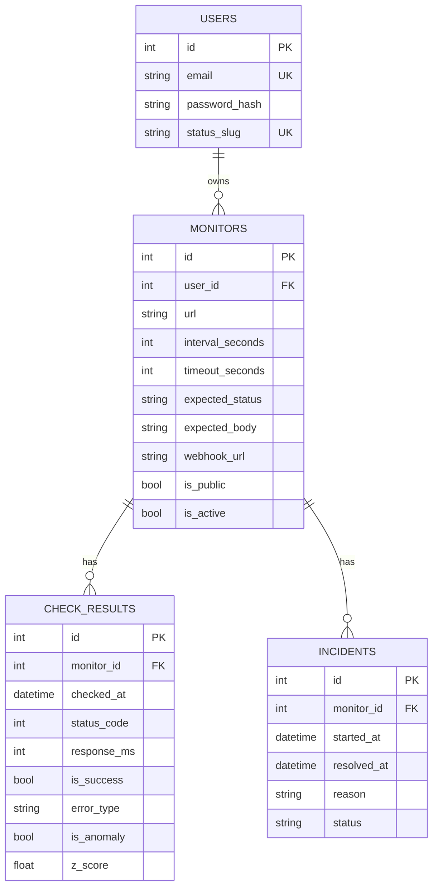
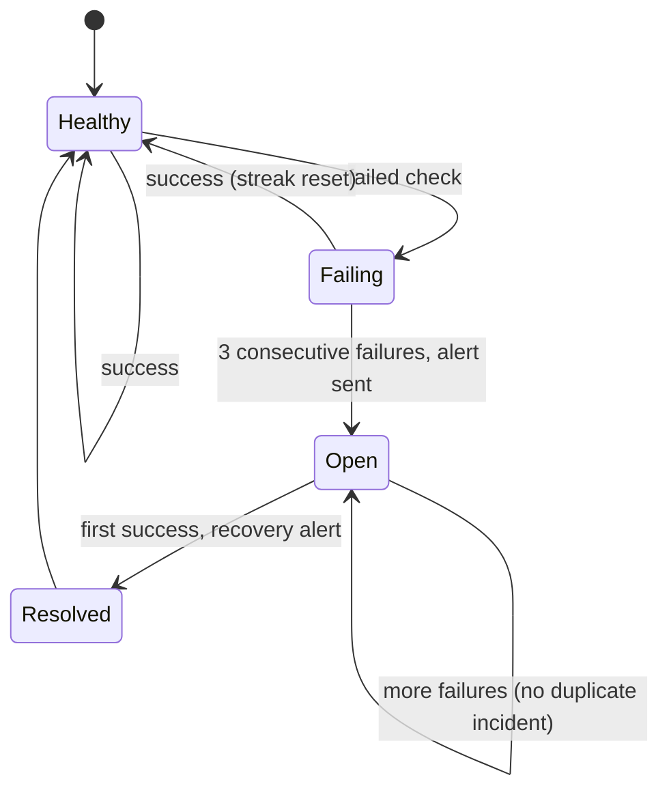

# PulseWatch — Architecture

## 1. Components

```mermaid
flowchart LR
    U[User / Browser] --> W
    C[API client] --> W
    P[Public visitor] --> W
    subgraph WEB[Web process - FastAPI]
        W[REST API + Dashboard + Public status page]
        V[SSRF validator]
        W --> V
    end
    W <--> DB[(PostgreSQL)]
    subgraph SCH[Scheduler process - APScheduler]
        S[Select due monitors] --> H[Health checker - HTTPX]
        H --> A[Anomaly detector - z-score]
        A --> I[Incident manager]
    end
    S <--> DB
    I --> DB
    H --> T[Monitored APIs]
    I --> E[Email SMTP]
    I --> K[Slack / webhook]
```

## 2. One monitoring cycle

```mermaid
sequenceDiagram
    participant Sch as Scheduler tick (every 10s)
    participant DB as PostgreSQL
    participant HC as Health checker
    participant T as Target API
    participant IM as Incident manager
    participant AL as Alerts
    Sch->>DB: monitors that are active and due
    loop each due monitor (thread pool)
        Sch->>HC: run_check(monitor)
        HC->>HC: validate URL (SSRF)
        HC->>T: GET (no redirects, timeout)
        T-->>HC: status / body / or error
        HC-->>IM: outcome
        IM->>DB: baseline of last 30 response times
        IM->>IM: z-score anomaly test
        IM->>DB: store check_result
        IM->>DB: open or resolve incident
        IM->>AL: email and webhook (incident / anomaly)
    end
```

## 3. Data model

```mermaid
erDiagram
    USERS ||--o{ MONITORS : owns
    MONITORS ||--o{ CHECK_RESULTS : has
    MONITORS ||--o{ INCIDENTS : has
    USERS {
        int id PK
        string email UK
        string password_hash
        string status_slug UK
    }
    MONITORS {
        int id PK
        int user_id FK
        string url
        int interval_seconds
        int timeout_seconds
        string expected_status
        string expected_body
        string webhook_url
        bool is_public
        bool is_active
    }
    CHECK_RESULTS {
        int id PK
        int monitor_id FK
        datetime checked_at
        int status_code
        int response_ms
        bool is_success
        string error_type
        bool is_anomaly
        float z_score
    }
    INCIDENTS {
        int id PK
        int monitor_id FK
        datetime started_at
        datetime resolved_at
        string reason
        string status
    }
```

## 4. Incident lifecycle

```mermaid
stateDiagram-v2
    [*] --> Healthy
    Healthy --> Healthy: success
    Healthy --> Failing: failed check
    Failing --> Healthy: success (streak reset)
    Failing --> Open: 3 consecutive failures, alert sent
    Open --> Open: more failures (no duplicate incident)
    Open --> Resolved: first success, recovery alert
    Resolved --> Healthy
```
